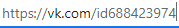
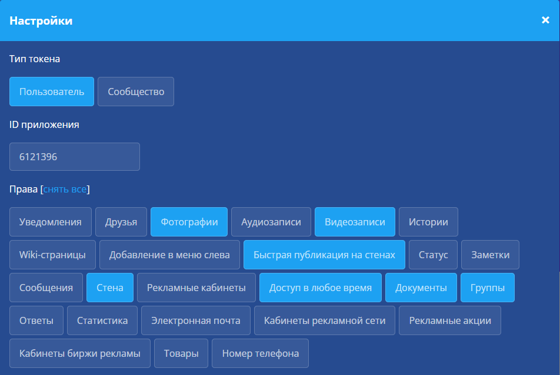

# Оглавление

- [Описание](#Description)
- [Содержание проекта](#ProjectСontent)
- [Конфигурационный файл](#Configurationfile)
- [Настройка вк](#VkSetting)
- [Установка cuda](#InstallCuda)

# Описание 

*Данный проект содержит проект анализирующий игры* 
*(Fifa, Nba, Nhl) в реальном времени*

# Содержание проекта 

### .gitignore

*Фильтрующий файл, чтобы в репозиторий не летел муcор, можно спокойно игнорировать данный файл*

### conf.ini

*Файл с настройками проект, подронее о нем [тут](#Configurationfile)*

### req.txt

*Необходимые библиотеки для python. Для установки пишем*

      pip3 install --upgrade -r req.txt

# Описание 

### Получение id пользователя

*Заходим на страничку пользователя и кликаем на адресную строку,*
*если видим что-то такое:*
  

  
*то просто копируем цифры после id, а если там слова, то нужно перейти в настройки профиля, спуститься ниже, найти "адрес страницы", нажать изменить и в открывшемся окошечке будет наш номер пользователя.*

### Получение id группы

*Заходим на страничку группы и кликаем на адресную строку,*
*если видим что-то такое:*
  

  
*то просто копируем цифры после public, а если там слова, то нужно перейти в управление группой, найти "адрес" и под полем для заполнения после слова public будет наш номер группы.*

### Получение id альбома

*Заходим на страничку альбома и кликаем на адресную строку,*
*видим что-то такое:*
  

  
*и просто копируем цифры после нижнего подчеркивания.*

### Получение токена

*Заходим на сайт https://vkhost.github.io/, выбираем настройки,*
*в появившемся окне выбираем такие права:*
  

  
*нажимаем получить, разрешить и в адресной строке копируете все от access_token= до &expires_in*

# Установка cuda 

1. Обновляем видео драйвер
2. Устанавливаем [cuda драйвер](https://developer.nvidia.com/cuda-downloads)

### Настройка python

    pip3 install --upgrade torch torchvision torchaudio --extra-index-url https://download.pytorch.org/whl/cu116

### Полезная документация (если что-то не работает)

- [PyTorch](https://pytorch.org/get-started/locally/)
- [Cuda toolkit](https://docs.nvidia.com/cuda/cuda-installation-guide-microsoft-windows/index.html)
